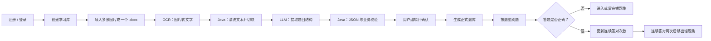
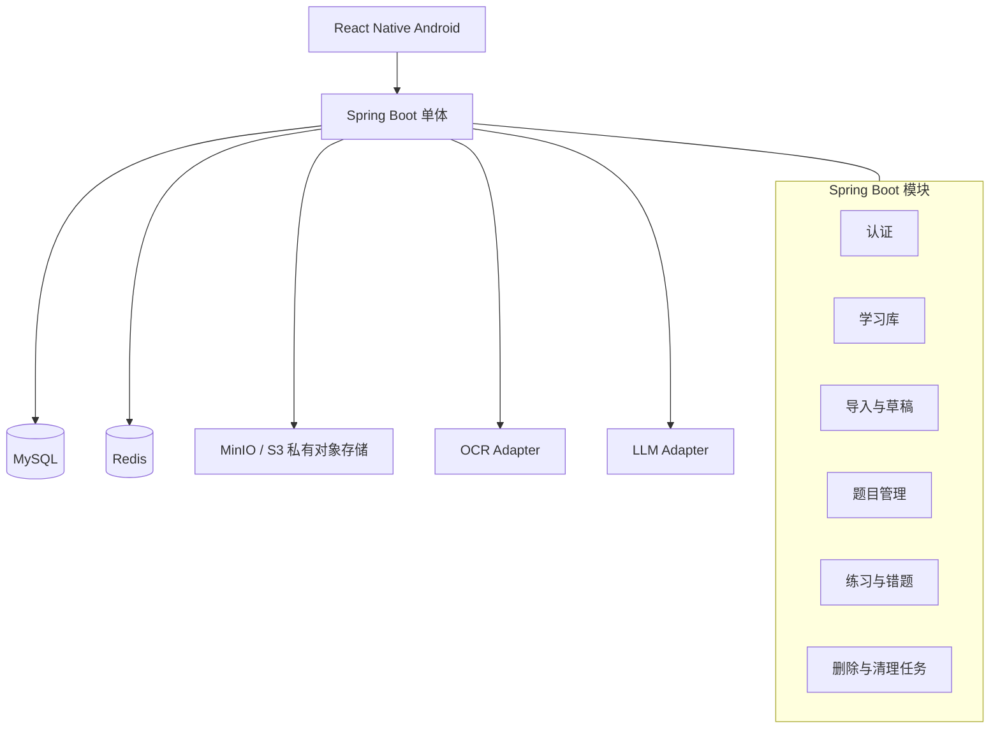

# AI 学习平台 V1

> 面向大学生期末备考的 Android 学习助手：把题目图片或 Word 资料整理为可确认的题库，再按题型刷题和处理错题。

**当前状态：** 已在 Android 真机验证图片与 `.docx` 导入、PaddleOCR / DeepSeek 草稿生成、草稿编辑和人工确认入库；其余功能仍按主闭环继续开发和验证。

## 项目定位

用户为每门课程创建一个学习库，将多张题目图片或一个 `.docx` 导入其中。系统先用 OCR 提取文字，再由 Java 后端清洗、切块并调用 LLM 提取题目结构，最后生成可编辑草稿；用户确认后，草稿才会成为正式题目。用户可选择刷完整题库或错题集，并按单选、多选、判断分开练习。

学习库是数据隔离边界：题目、导入批次、作答记录和错题状态都必须属于同一个学习库。

## 核心流程



## V1 核心功能

- 账号：注册、登录、刷新令牌与退出登录。
- 学习库：创建、查看、编辑和删除学习库；不同学习库的数据严格隔离。
- 图片导入：一个批次可选择多张图片，AI 自动识别每张图片中的全部题目。
- Word 导入：一个批次可导入一个 `.docx` 文件，且不能与图片混传；对“题号 → 题干 → A/B/C/D → 答案”这类标准题库，Java 直接按原文拆出草稿，不调用大模型也不会改写或丢失题干；格式混乱的 Word 才按题号切成每批约 3 题交给 DeepSeek 整理。同一学习库再次上传 Word 时，会自动取消并删除此前尚未完成的 Word 临时任务，只处理最新一份。
- 导入任务：逐文件显示处理状态、失败原因和重试入口；部分文件成功时，成功草稿可先确认。
- 草稿确认：用户可编辑题干、选项、题型、答案、解析和知识点；未确认前不会写入正式题库。
- 题目管理：支持单选、多选、判断题的查看、编辑和删除。
- 刷题：选择“完整题库”或“错题集”后，再选择题型；同一次练习不会混入不同题型。
- 错题集：答错进入错题集；连续答对两次标记为已掌握并移出；中途答错时计数归零。
- 继续练习：练习会话有效期为 24 小时，退出后可继续未完成会话。

## 导入链路的职责划分

资料变题目只发生在导入环节，四方职责不能混淆：

| 角色 | 只负责什么 |
| --- | --- |
| OCR 服务 | 将图片转换为文字、文字位置和识别置信度。 |
| Java 后端 | 文件校验、文本清洗、分页合并、按长度/章节切块、任务重试、JSON/业务校验、保存数据。 |
| LLM | 仅在图片文字或非标准 Word 无法按固定规则拆题时，识别题目边界和题型并输出严格 JSON。 |
| 用户 | 查看、修改和补充草稿，做最终入库确认。 |

V1 中 LLM **不猜答案、不生成解析、不生成知识点、不改写题目**。原文没有答案或解析时，对应草稿字段保持为空并提示用户补充；AI 永远不能直接写入正式题库。

## V1 不包含的功能

- 学习提醒、推送、学习计划、间隔复习和学习统计。
- 会员、班级协作、收藏系统、复杂报告。
- AI 聊天导师、AI 学习建议。
- iOS 客户端、PDF 导入、旧版 `.doc` 导入、复杂公式识别。

## 技术栈

| 层级 | 技术选型 | 主要用途 |
| --- | --- | --- |
| Android 客户端 | React Native CLI + TypeScript | Android App、资料选择上传、草稿确认与刷题界面 |
| 客户端导航与状态 | React Navigation、TanStack Query、Zustand | 页面跳转、接口缓存与局部界面状态 |
| 安全存储 | react-native-keychain | 安全保存 accessToken 与 refreshToken |
| 后端 | Java 17 + Spring Boot + Spring Security | REST API、认证、业务服务与后台任务 |
| 数据库 | MySQL 8 | 用户、学习库、题目、会话、作答和错题等业务事实来源 |
| 缓存与辅助能力 | Redis | 缓存、限流、锁与令牌撤销辅助 |
| 文件存储 | MinIO / S3 兼容对象存储 | 仅保存导入期间的临时原始文件 |
| AI 适配层 | OCR Adapter + LLM Adapter | 可替换地调用 OCR 与大模型服务 |

## 系统架构



关键约束：

- 后端从 JWT 取得用户身份；所有库内接口同时验证 `userId + libraryId`。
- 导入任务持久化，应用重启后可继续处理；不能只依赖内存异步任务。
- 刷题开始和获取下一题时不返回正确答案与解析；仅在提交答案后返回。
- 上传原文件、识别文字与草稿仅为临时数据：用户处理完该文件的所有草稿后立即删除，正式入库的题目不受影响；同一学习库的新 Word 会替换未完成的旧 Word。

## Android APK 本机联调

- 预览 APK 在开发阶段需要访问电脑上的 Spring Boot 服务。当前使用电脑的 Tailscale 地址：`http://100.71.105.6:8080`。
- 手机和电脑都登录同一个 Tailscale 网络后，即使手机使用 5G 或其他 Wi-Fi，也能访问这个地址；电脑和 Spring Boot 必须保持运行。图片导入还需要本机 PaddleOCR；题目草稿生成通过 DeepSeek API 完成。
- 这仍是开发者私有网络联调，不适合普通用户直接使用。Android 9 及以上默认阻止普通 HTTP 请求，因此构建配置显式开启了 `usesCleartextTraffic`。
- 给真实用户使用前，后端必须部署为固定的公网 HTTPS 地址，并移除该调试性配置。

## DeepSeek API 配置

题目草稿由后端调用 DeepSeek，Key 只保存在运行后端的电脑中，不会传给 Android 安装包，也不会提交到 GitHub。

```powershell
setx DEEPSEEK_API_KEY "你的 DeepSeek API Key"
```

设置后请关闭旧的后端终端，重新打开一个终端再启动 Spring Boot。未配置、Key 无效、余额不足和请求过快都会在导入记录中显示可理解的失败原因。

## 计划中的目录结构

```text
ai-learning-platform/
├── docs/                         # 产品与技术文档
│   ├── AI学习平台_V1_PRD.md
│   ├── AI学习平台_V1_整体架构.md
│   ├── AI学习平台_V1_技术实现文档.md
│   └── AI学习平台_V1_接口文档.md
├── frontend/                     # React Native Android 客户端（待开发）
├── backend/                      # Spring Boot 服务端（待开发）
└── README.md
```

## 推荐开发顺序

1. 学习库与本地假数据版题目练习。
2. 错题规则与练习会话。
3. 登录、令牌安全存储与续期。
4. 导入批次、文件状态与草稿确认。
5. 图片与 `.docx` 解析。
6. OCR 与 LLM Adapter 接入。
7. Android 真机联调与试用。

每个阶段都应先在手机上走通完整流程，再进入下一阶段。

## 项目文档

以下四份文档中，PRD 是产品范围与业务规则的唯一事实来源；其他文档如与 PRD 冲突，以 PRD 为准。

- [产品需求文档（PRD）](PRD.md)
- [整体架构](整体架构.md)
- [技术实现文档](技术实现文档.md)
- [接口文档](接口文档.md)

## 后续计划

- 按上述顺序搭建 React Native 与 Spring Boot 的可运行骨架。
- 先完成“学习库 → 题目 → 刷题 → 错题”闭环，再接入真实 OCR 与 LLM。
- 用真实 Android 设备验证导入、草稿确认、按题型刷题与错题规则。
